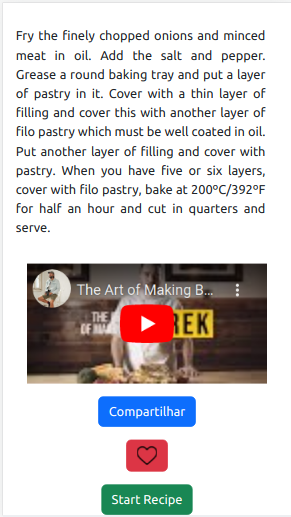

# Welcome to the Recipes App project repository!

### README Translations:

-   [English](/README.en.md)
-   [Portuguese](/README.md)

* * *

## 👨‍💻 What was developed:

-   A recipe app was developed, using the most modern within the React ecosystem: Hooks and Context API!

    It is possible to: view, search, filter, favorite and follow the progress of preparing food and drink recipes!

    The database is 2 different APIs, one for food and one for drinks.

    The layout focuses on mobile devices, so all prototypes are developed on smaller screens.

:bulb:**See a sample below:**

## Skills used:

-   Use_Redux_to manage state
-   use the library_React-Redux_
-   Using the Context API of_React_to manage state
-   use the_React Hook useState_
-   use the_React Hook useContext_
-   use the_React Hook useEffect_
-   Create custom Hooks

# requirements

In this project, the person using the app can search for a specific recipe, explore recipes based on different criteria, favorite and make the recipes, among other features.

The screens vary depending on the type of recipe (if it is food or drink, in this case).

Note: The way APIs should be structured follows the following models:<https://www.themealdb.com/api.php>e<https://www.thecocktaildb.com/api.php>

## Unitary tests

### 1 - Develop unit tests so that coverage is at least 90%

 

  
<strong>Observações técnicas</strong>

-   In this requirement we will cover our application with unit/integration tests using the library[React Testing Library](https://testing-library.com/docs/react-testing-library/intro/), take this opportunity to put into practice the[Test Driven Development](https://blog.betrybe.com/tecnologia/tdd-test-driven-development/)

-   Remember that in Test Driven Development, you must write the tests along with the development of new features. For this reason, this requirement will only pass the evaluator as long as your application has the desired test coverage. If you add new functionality and don't create tests for it, this requirement may stop passing the evaluator.

-   The tests you create will not influence the other requirements in the evaluator. You will develop your unit/integration tests using the React Testing Library, while the evaluator will use the library[Cypress](https://docs.cypress.io/)to assess requirements, including coverage requirements.

 

  
<strong>O que será verificado</strong>

-   Check unit test coverage
    
 

* * *

## tel A's login

> ⚠️ Note: For the tests to pass, the component must be called`Login.js`.

### 2 - Create all elements that must respect the attributes described in the prototype for the login screen

  
<strong>Observações técnicas</strong>

-   The email input must have the attribute`data-testid="email-input"`;
-   The password input must have the attribute`data-testid="password-input"`;
-   The "Enter" button must have the attribute`data-testid="login-submit-btn"`.
    

 

  
<strong>O que será verificado</strong>

-   If the data-testids email-input, password-input and login-submit-btn are correct.
    
 

* * *

### 3 - Develop the screen so that the person can write their email in the email input and their password in the password input

 

  
<strong>O que será verificado</strong>

-   The possibility to write the email in the email input.
-   The possibility to write the password in the password input.
    
 

* * *

### 4 - Develop the screen so that the form is only valid after a valid email address and a password of more than 6 characters are filled in

> This requirement also includes page coverage tests`Login.js`.

 

  
<strong>Observações técnicas</strong>

-   The form is only valid after a valid email address and a password of more than 6 characters are filled in;
-   If the form is invalid, the submit button must be disabled, containing the property`disabled`;
-   If the form is valid, the submit button must be activated, not containing the property`disabled`.
    

 

  
<strong>O que será verificado</strong>

-   The button must be disabled if the email is invalid
-   The button must be disabled if the password must be 6 characters or less
-   The button must be enabled if the email and password are valid
-   Checks 45% coverage of the Login screen
    
 

* * *

### 5 - After submitting the form, save the user's email in the key to localStorage`user`and the tokens in the keys`mealsToken`e`drinksToken`

 

  
<strong>Observações técnicas</strong>

-   After submission, the user's e-mail must be saved in`localStorage`in the key`user`not format`{ email: email-da-pessoa }`.
-   For tokens, the test value is always`1`.
    

 

  
<strong>O que será verificado</strong>

-   If after submission the user key is saved in localStorage.
-   If after submission, mealsToken and drinksToken keys are saved in localStorage
    

* * *

### 6 - Redirect the user to the main food recipes screen after successful login submission and validation

> This requirement also includes page coverage tests`Login.js`.

 

  
<strong>O que será verificado</strong>

-   Whether the route switches to the main food recipes screen.
-   Checks 90% coverage of the Login screen.
    

* * *

## Header

> ⚠️ Note: For the tests to pass, the component must be called`Header.js`.

### 7 - Implement the header according to the needs of each screen

 

  
<strong>Observações técnicas</strong>

-   The Header must have the following elements:
    -   Profile icon with data-testid`profile-top-btn`, which must always be present;
    -   Search icon with data-testid`search-top-btn`, which should only be present on some pages (as shown in the list below);
    -   Page title with data-testid`page-title`, which must always be present.
-   Icons can be found at`src/images/profileIcon.svg`is at`src/images/searchIcon.svg`.
-   Each page must have its own title, which will be rendered by the Header.
-   All routes will be verified, so create routes that have not yet been created.
    

 

  
<strong>O que será verificado</strong>

-   Rota "/":**no**possui header
-   Route "/meals": has the header with the title "Meals" and the profile and search icons
-   Route "/drinks": has the header with the title "Drinks" and the profile and search icons
-   Route "/meals/{recipe-id}":**no**possui header
-   Rotated "/drinks/{recipe-id}":**no**possui header
-   Rota "/meals/{id-da-receita}/in-progress":**no**possui header
-   Rotate "/drinks/{receipt-id}/in-progress":**no**possui header
-   Route "/profile": it has the header with the title "Profile" and the profile icon, but**which**the search icon
-   Route "/done-recipes": has the header with the title "Done Recipes" and the profile icon, but**which**the search icon
-   "/favorite-recipes" route: it has the header with the title "Favorite Recipes" and the profile icon, but**which**the search icon
    

* * *

### 8 - Redirect the user to the profile screen by clicking the profile button

> This requirement also includes component coverage tests`Header.js`.

 

  
<strong>O que será verificado</strong>

-   After clicking the profile button with testid`profile-top-btn`, check:
    -   The route switches to the profile screen`/profile`
    -   Header title changes to "Profile"
-   Checks 45% coverage of the Header component.
    

* * *

### 9 - Develop the search button that, when clicked, the search bar should appear. The same goes for hiding it

> This requirement also includes component coverage tests`Header.js`.

 

  
<strong>Observações técnicas</strong>

  
  * Nesse requisito você deverá apenas implementar a lógica para esconder e mostrar o input de busca. A funcionalidade, dentre outros detalhes da barra de busca só serão implementados no requisito 10!
  * O input de busca que será exibido deve possuir o atributo `data-testid="search-input"`

 

  
<strong>O que será verificado</strong>

  
  - Se ao clicar no botão de busca pela primeira vez, a barra de busca aparece.
  - Se ao clicar no botão de busca pela segunda vez, a barra de busca desaparece;
  - Verifica a cobertura de 90% do componente Header

* * *

## Search bar - Header

> ⚠️ Note: For the tests to pass, the component must be called`SearchBar.js`.

### 10 - Implement the search bar elements respecting the attributes described in the prototype

 

  
<strong>Observações técnicas</strong>

-   The data-testids must exist both in the search bar and in all radio-buttons.
-   The ingredient search radio button must have the attribute`data-testid="ingredient-search-radio"`;
-   The search by name radio button must have the attribute`data-testid="name-search-radio"`;
-   The first letter search radio button must have the attribute`data-testid="first-letter-search-radio"`.
-   The search button must have the attribute`data-testid="exec-search-btn"`
    

 

  
<strong>O que será verificado</strong>

-   If the data-testids are correct both in the search bar and in all radio-buttons.
    

* * *

### 11 - Implement 3 radio buttons in the search bar: Ingredient, Name and First letter

 

  
<strong>Observações técnicas</strong>

-   The search bar must have 3_radio buttons_:`Ingredient`,`Name`e`First letter`. They, together with the`search-input`, must change the way the recipes will be filtered after clicking on the`Search`.  Os_endpoints_of the API you should use can be consulted[here for the food API](https://www.themealdb.com/api.php)e[here for the Beverage API](https://www.thecocktaildb.com/api.php).
-   If the selected radio is`Ingredient`, the API fetching is done correctly by the ingredient. The endpoint used must be`https://www.themealdb.com/api/json/v1/1/filter.php?i={ingrediente}`;
-   If the selected radio is`Name`, the API search is done correctly by name. The endpoint used must be`https://www.themealdb.com/api/json/v1/1/search.php?s={nome}`;
-   If the selected radio is`First letter`, the API search is correctly done by the first letter. The endpoint used must be`https://www.themealdb.com/api/json/v1/1/search.php?f={primeira-letra}`;
    -   If the selected radio is`First letter`and the API search is performed with more than one letter, you must display a`alert`com a mensagem "Your search must have only 1 (one) character".
-   :bulb:**Example: When selecting`Ingredient`and search for`chicken`, you must use the endpoint`https://www.themealdb.com/api/json/v1/1/filter.php?i=chicken`.**

    :bulb:**Heads up:**Utilize`global.alert`to avoid the`warnings`of eslint on the use of`alert`not code. :bulb: Note: For this requirement, only the main food recipes screen will be checked.

    

 

  
<strong>O que será verificado</strong>

-   If the selected radio is Ingredient, the API search is done correctly by the ingredient
-   If the selected radio is Name, the API search is done correctly by name
-   If the selected radio is First letter, the API search is done correctly by the first letter
-   If the selected radio is First letter and the API search is performed with more than one letter, an alert must be displayed
    

* * *

### 12 - Search the food API if the person is on the food page, and on the beverage API if the person is on the beverage page

> This requirement also includes component coverage tests`SearchBar.js`.

 

  
<strong>Observações técnicas</strong>

-   On the drinks screen, if the selected radio is`Ingredient`, the API fetching is done correctly by the ingredient. The endpoint used must be`https://www.thecocktaildb.com/api/json/v1/1/filter.php?i={ingrediente}`;
-   On the drinks screen, if the selected radio is`Name`, the API search is done correctly by name. The endpoint used must be`https://www.thecocktaildb.com/api/json/v1/1/search.php?s={nome}`;
-   On the drinks screen, if the selected radio is`First letter`, the API search is correctly done by the first letter. The endpoint used must be`https://www.thecocktaildb.com/api/json/v1/1/search.php?f={primeira-letra}`;

          * Na tela de bebidas, se o radio selecionado for `First letter` e a busca na API for feita com mais de uma letra, deve-se exibir um `alert` com a mensagem "Your search must have only 1 (one) character".

    :bulb:**Heads up:**Utilize`global.alert`to avoid the`warnings`of eslint on the use of`alert`not code. :bulb: Note: For this requirement, only the main screen of beverage recipes will be checked, as the food one has already been checked in the previous requirement.

    

 

  
<strong>O que será verificado</strong>

-   On the drinks screen, if the selected radio is Ingredient, the API search is done correctly by the ingredient
-   On the drinks screen, if the selected radio is Name, the API search is done correctly by name
-   On the drinks screen, if the radio selected is First letter, the API search is done correctly by the first letter
-   On the drinks screen, if the selected radio is First letter and the API search is done with more than one letter, an alert should be displayed
-   Checks 45% coverage of SearchBar component
    

* * *

### 13 - Redirect to recipe details screen if only one recipe is found, with its ID in the URL

 

  
<strong>Observações técnicas</strong>

-   If only one food is found, go to its detail route (`/meals/{id-da-receita}`);
-   If only one drink is found, go to its detail route (`/drinks/{id-da-receita}`).
    

 

  
<strong>O que será verificado</strong>

-   If only one food is found, go to its detail route.
-   If in case only one drink is found, it should go to its detail route.
    

* * *

### 14 - Show recipes on cards, if more than one recipe is found

 

  
<strong>Observações técnicas</strong>

-   Show recipes on cards like the ones on the main screen if more than one recipe is found.
-   Each card must contain the`data-testid="${index}-recipe-card"`.
-   Each image must contain the`data-testid="${index}-card-img"`.
-   Each tag with the recipe name must have the`data-testid="${index}-card-name"`.
-   Show only the first 12 recipes (or less if there are no 12).
    

 

  
<strong>O que será verificado</strong>

-   If more than one food is found, show the first 12.
-   If more than one drink is found, display the first 12.
    

* * *

### 15 - Display a`alert`if no recipe is found

> This requirement also includes component coverage tests`SearchBar.js`.

 

  
<strong>Observações técnicas</strong>

-   O alert deve conter o texto "Sorry, we haven't found any recipes for these filters."

    :bulb:**Heads up:**Utilize`global.alert`to avoid the`warnings`of eslint on the use of`alert`not code. 

    

 

  
<strong>O que será verificado</strong>

-   If no food is found the alert should be displayed.
-   If no drink is found the alert should be displayed.
-   Checks 90% coverage of the SearchBar component.
    

* * *

## Menu inferior

> ⚠️ Note: For the tests to pass, the component must be called`Footer.js`.

### 16 - Implement the lower menu by positioning it in a fixed way and containing 2 icons: one for food and one for drinks

> This requirement also includes component coverage tests`Footer.js`.

 

  
<strong>Observações técnicas</strong>

-   All necessary icons are available in the folder`src/images`;
-   The bottom menu must have the attribute`data-testid="footer"`;
-   The element leading to the drinks page must use the icon`drinkIcon.svg`and have the attribute`data-testid="drinks-bottom-btn"`;
-   The element that leads to the food page must use the icon`mealIcon.svg`and have the attribute`data-testid="meals-bottom-btn"`;
-   The lower menu must always be fixed at the bottom of the page.
    

     

      
<strong>O que será verificado</strong>

-   If the bottom menu exists and contains the correct icons
-   If the lower menu is always pinned to the bottom of the page.
-   Checks 45% coverage of Footer component.
    

* * *

### 17 - Display the lower menu only on the screens indicated by the prototype

 

  
<strong>Observações técnicas</strong>

-   All routes will be verified, so create routes that have not yet been created.
    

 

  
<strong>O que será verificado</strong>

-   Rota "/":**no**must ter footer
-   Rota "/meals": deve ter footer
-   Rota "/drinks": deve ter footer
-   Route "/meals/{recipe-id}":**no**must ter footer
-   Rotated "/drinks/{recipe-id}":**no**must ter footer
-   Rota "/meals/{id-da-receita}/in-progress":**no**must ter footer
-   Rotate "/drinks/{receipt-id}/in-progress":**no**must ter footer
-   Rota "/profile": deve ter footer
-   Rota "/done-recipes":**no**must ter footer
-   Rota "/favorite-recipes":**no**must ter footer
    

* * *

### 18 - Redirect the user to the correct screen by clicking on each icon in the bottom menu

> This requirement also includes component coverage tests`Footer.js`.

 

  
<strong>O que será verificado</strong>

-   If there is a redirection to the drinks list when clicking on the drinks icon;
-   If there is redirection to the food list when clicking on the food icon;
-   Checks 90% coverage of the Footer component.
    

* * *

## Recipes main screen

> ⚠️ Note: For the tests to pass, the component must be called`Recipes.js`.

:bulb:**Tip:**remember to componentize the elements in React very well on this screen, thus avoiding problems of logic and complexity ;).

### 19 - Load the first 12 food or drink recipes, one on each card

 

  
<strong>Observações técnicas</strong>

-   Recipes must be loaded when launching the page.
-   If the recipes are for food, you must load the first 12 recipes obtained through the endpoint`https://www.themealdb.com/api/json/v1/1/search.php?s=`
-   If the recipes are for drinks, you must load the first 12 recipes obtained through the endpoint`https://www.thecocktaildb.com/api/json/v1/1/search.php?s=`
-   The card must have the`data-testid="${index}-recipe-card"`
-   A photo (`strMealThumb`or`strDrinkThumb`) must have the`data-testid="${index}-card-img"`
-   The name (`strMeal`or`strDrink`) must have the`data-testid="${index}-card-name"`
    

 

  
<strong>O que será verificado</strong>

-   The screen has the data-testids of all 12 cards from the food screen
-   If the recipes are for food, you must load the first 12 recipes
-   The screen has the data-testids of all 12 cards from the drinks screen
-   If the recipes are for drinks, you must load the first 12 recipes
    

* * *

### 20 - Implement the category buttons to be used as a filter

> This requirement also includes page coverage tests`Recipes.js`.

  
<strong>Observações técnicas</strong>

-   Each button must contain the prefixed attribute`data-testid=${categoryName}-category-filter`and only the first 5 categories returned from the API should be displayed.
-   If the recipes are for food, you must display the first 5 food categories obtained through the endpoint`https://www.themealdb.com/api/json/v1/1/list.php?c=list`;
-   If the recipes are for drinks, you must display the first 5 categories of drinks obtained through the endpoint`https://www.thecocktaildb.com/api/json/v1/1/list.php?c=list`.
    

     

      
<strong>O que será verificado</strong>

-   If the recipes are for food, display the first 5 food categories
-   If the recipes are for drinks, the first 5 drink categories must be displayed
-   Check 45% coverage of the Revenue screen
    

* * *

### 21 - Implement the filter of recipes through the API by clicking on the category filter

 

  
<strong>Observações técnicas</strong>

-   The recipes, filtered by categories, must be obtained through the API of[foods](https://www.themealdb.com/api.php)or[drinks](https://www.thecocktaildb.com/api.php). The endpoints of`Filter by Category`.
-   On the food screen if the selected category is`Beef`the endpoint used will be`https://www.themealdb.com/api/json/v1/1/filter.php?c=Beef`
-   On the drinks screen if the selected category is`Cocktail`the endpoint used will be`https://www.thecocktaildb.com/api/json/v1/1/filter.php?c=Cocktail`
-   In addition to the categories provided by the API, we will also add a button that should clear the filters, returning all recipes again. This button must have the text**"All"**and the attribute`data-testid="All-category-filter"`.
-   If the category returns only one result,**NO**redirect to the details page.
    

 

  
<strong>O que será verificado</strong>

-   If the recipes are food and the category is "Beef", you must load the first 12 recipes from the "Beef" category
-   If the recipes are for food and the category is "Breakfast", you must load the first 12 recipes from the "Breakfast" category
-   If the recipes are food and the category is "Chicken", you must load the first 12 recipes from the "Chicken" category
-   If the recipes are for food and the category is "Dessert", you must load the first 12 recipes from the "Dessert" category
-   If the recipes are for food and the category is "Goat", you must load the first 12 recipes in the "Goat" category
-   If the recipes are drinks and the category is "Ordinary Drink", you must load the first 12 recipes from the "Ordinary Drink" category
-   If the recipes are for drinks and the category is "Cocktail", the first 12 recipes of the "Cocktail" category must be loaded
-   If the recipes are for drinks and the category is "Shake", the first 12 recipes of the "Shake" category must be loaded
-   If the recipes are for drinks and the category is "Other/Unknown", you must load the first 12 recipes from the "Other/Unknown" category
-   If the recipes are for drinks and the category is "Cocoa", the first 12 recipes of the "Cocoa" category must be loaded
-   If the recipes are for food, there must be an option called "All" that clears the category filters
-   If the recipes are for drinks, there must be an option called "All" that clears the category filters
    

* * *

### 22 - Implement the filter as a toggle, which if selected again, the app should return the recipes without any filter

 

  
<strong>O que será verificado</strong>

-   If the recipes are for food and the filter is selected again, the first 12 recipes without filter must be returned.
-   If the recipes are for drinks and the filter is selected again, the first 12 recipes without filter must be returned.
    

* * *

### 23 - Redirect the user by clicking on the card to the details screen, which must change the route and contain the recipe id in the URL

> This requirement also includes page coverage tests`Recipes.js`.

 

  
<strong>Observações técnicas</strong>

-   If the recipe is for a food, the person must be redirected to the route`/meals/{id-da-receita}`
-   If the recipe is for a drink, the person must be redirected to the route`/drinks/{id-da-receita}`
    

 

  
<strong>O que será verificado</strong>

-   If the recipes are for food, the route must change to the recipe details screen
-   If the recipes are for drinks, the route must change to the recipe details screen
-   Checks 90% coverage of the Revenue screen
    

* * *

## Recipe details screen

> ⚠️ Note: For the tests to pass, the component must be called`RecipeDetails.js`.

:bulb:**Tip:**remember to componentize the elements in React very well on this screen, thus avoiding problems of logic and complexity ;).

### 24 - Make a request to the API passing the`id`of the recipe that must be available in the URL parameters

  
<strong>Observações técnicas</strong>

-   To check if the request to the food API was made, the endpoint used must be`https://www.themealdb.com/api/json/v1/1/lookup.php?i={id-da-receita}`;
-   To verify that the request to the drinks API was made, the endpoint used must be`https://www.thecocktaildb.com/api/json/v1/1/lookup.php?i={id-da-receita}`.
    

 

  
<strong>O que será verificado</strong>

-   Whether the request to the food API was made.
-   Whether the request to the Beverage API was made.
    

* * *

### 25 - Develop the screen so that it contains an image of the recipe, the title, the category in case of food and whether or not it is alcoholic in case of drinks, a list of ingredients followed by amounts, instructions, a youtube video "embedded" " and recommendations

  
<strong>Observações técnicas</strong>

The verification will be done through the recipes returned by the API, for example: the text of the ingredients and the instructions, from the data-testids attributes:

-   The photo must have the attribute`data-testid="recipe-photo"`;
-   The title must have the attribute`data-testid="recipe-title"`;
-   Category text must have the attribute`data-testid="recipe-category"`;
-   Ingredients must have the attribute`data-testid="${index}-ingredient-name-and-measure"`;
-   The instruction text must have the attribute`data-testid="instructions"`;
-   The video, present only on the food screen, must have the attribute`data-testid="video"`;

    Remember: The youtube video should only be available for food recipes as it is not returned by[beverage API](https://www.thecocktaildb.com/api.php).

    :bulb: Tip: Do a search on`how to embed youtube video`here are some research suggestions to help you build the code.

 

  
<strong>O que será verificado</strong>

-   Whether the food screen has all data-testid attributes
-   If the drinks screen has all data-testid attributes
    

* * *

### 26 - Implement the recommendations. For food recipes, the recommendation should be drink, for drink recipes, the recommendation should be eaten.

  
<strong>Observações técnicas</strong>

-   You must make requests to the food and beverage APIs, and store the data, which will be used later in requirement 27 to generate recommendations.
-   On the food page, make a request to the drinks API, the endpoint used must be`https://www.thecocktaildb.com/api/json/v1/1/search.php?s=`;
-   On the drinks page, make a request to the food API, the endpoint used must be`https://www.themealdb.com/api/json/v1/1/search.php?s=`.
    

     

      
<strong>O que será verificado</strong>

-   If on the food page the request for the drinks API was made.
-   If on the drinks page the request for the food API was made.
    

* * *

### 27 - Implement the 6 recommendation cards, showing only 2. The scroll is horizontal, similar to a`carousel`

  
<strong>Observações técnicas</strong>

-   Render only the 6 recommended recipes;
    -   Only 2 recipes should be visible, with a horizontal scroll, similar to a`carousel`
-   The recommended recipes card must have the attribute`data-testid="${index}-recommendation-card"`;
        * Dentro do card o nome da receita recomendada deve possuir o atributo `data-testid="${index}-recommendation-title"`;
    

     

      
<strong>O que será verificado</strong>

-   If only two recommendations are visible on the screen at a time;
-   If the carousel is scrolled horizontally;
-   Whether all 6 recommendations exist on a food's detail screen
-   Whether all 6 recommendations exist on a drink's detail screen
    

* * *

### 28 - Develop a button named "Start Recipe" that should be fixed at the bottom of the screen at all times

 

  
<strong>Observações técnicas</strong>

-   The start recipe button must have the attribute`data-testid="start-recipe-btn"`;
    

 

  
<strong>O que será verificado</strong>

-   If the button has the data-testid attribute.
-   The placement of the button on the food details screen.
-   The placement of the button on the drink details screen.
    

* * *

### 29 - Implement the solution so that, if the recipe has already been made, the "Start Recipe" button disappears

> This requirement also includes page coverage tests`RecipeDetails.js`.

 

  
<strong>Observações técnicas</strong>

-   Remember that the recipes`finalizadas`previously are saved in the key`doneRecipes`as indicated in the localStorage session.
          * A chave `doneRecipes` só será populada pela aplicação no requisito `42`, mas não é necessário implementar o requisito `42` para este requisito passar no avaliador!
          * Caso o requisito `42` ainda não esteja implementado, você pode utilizar como base a estrutura da chave `doneRecipes` que é informada na sessão `Desenvolvimento > Observações técnicas > LocalStorage` do readme.
          * Você poderá testar o funcionamento com o próprio avaliador e também pode popular manualmente a chave `doneRecipes` para testar manualmente.
    

 

  
<strong>O que será verificado</strong>

-   If the start recipe button is not visible on a food's detail screen.
-   Whether the start recipe button is not visible on a drink's detail screen.
-   Checks coverage of 45% of a recipe's details screen.
    

* * *

### 30 - Implement the solution so that, if the recipe has been started but not finished, the button text should be "Continue Recipe"

 

  
<strong>Observações técnicas</strong>

-   Remember that the recipes`iniciadas`previously are saved in the key`inProgressRecipes`as indicated in the localStorage session.
          * A chave `inProgressRecipes` só será populada pela aplicação no requisito `40`, mas não é necessário implementar o requisito `40` para este requisito passar no avaliador!
          * Caso o requisito `40` ainda não esteja implementado, você pode utilizar como base a estrutura da chave `inProgressRecipes` que é informada na sessão `Desenvolvimento > Observações técnicas > LocalStorage` do readme.
          * Você poderá testar o funcionamento com o próprio avaliador e também pode popular manualmente a chave `inProgressRecipes` para testar manualmente.
    

 

  
<strong>O que será verificado</strong>

-   The "Continue Recipe" button on a food's detail screen.
-   The "Continue Recipe" button on a drink's detail screen.
    

* * *

### 31 - Redirect the user if the "Start Recipe" button is clicked, the route should change to the recipe in progress screen

 

  
<strong>O que será verificado</strong>

-   It redirects to the drink recipe screen in progress.
-   Redirects to the food recipe screen in progress.
    

* * *

### 32 - Implement a share button and a favorite button on the recipe

 

  
<strong>Observações técnicas</strong>

-   The share button must have the attribute`data-testid="share-btn"`;
-   The favorite button must have the attribute`data-testid="favorite-btn"`;
    

 

  
<strong>O que será verificado</strong>

-   Whether buttons are available on a food's detail screen.
-   Whether buttons are available on a drink's detail screen.
    

* * *

### 33 - Implement the solution so that, when clicking on the share button, the recipe link inside the app must be copied to the clipboard and a message warning that the link has been copied must appear on the screen in an HTML tag

 

  
<strong>Observações técnicas</strong>

-   The evaluator will not take into account the messages displayed by the`global.alert`, you should display it in the html.
-   The share button icon can be found at`src/images/shareIcon.svg`.
-   For this requirement you will need to use the clipboard-copy library. For more information, see the[library documentation](https://www.npmjs.com/package/clipboard-copy).
    

 

  
<strong>O que será verificado</strong>

-   If the message "Link copied!" appears on the screen inside an HTML tag and if the food recipe link has been copied to the clipboard.
-   If the message "Link copied!" appears on the screen inside an HTML tag and if the drink recipe link has been copied to the clipboard.
    

* * *

### 34 - Save favorite recipes to`localStorage`in the key`favoriteRecipes`

 

  
<strong>Observações técnicas</strong>

-   Remember that the recipes`favoritadas`previously are saved in the key`favoriteRecipes`as indicated in the localStorage session.
-   Favorite recipes must be saved in the`localStorage`in the key`favoriteRecipes`not format`[{ id, type, nationality, category, alcoholicOrNot, name, image }]`.
    

 

  
<strong>O que será verificado</strong>

-   Checks if after favoriteing a food recipe, it is saved correctly in localStorage
-   Checks if after favoriteing a drink recipe, it is saved correctly in localStorage
    

* * *

### 35 - Implement the heart icon (favorite) so that: it must be filled in if the recipe is favorited and empty otherwise

 

  
<strong>Observações técnicas</strong>

-   Button icons can be found at`src/images/whiteHeartIcon.svg`is at`src/images/blackHeartIcon.svg`, respectively.
    

 

  
<strong>O que será verificado</strong>

-   If the favorite food comes with a full heart.
-   If the non-favorite food comes with an empty heart.
-   If the favorite drink comes with a full heart.
-   If the non-favorite drink comes with an empty heart.
    

* * *

### 36 - Implement the logic on the favorite button. If clicked, the heart icon should change its current state, if filled, it should change to empty and vice versa.

> This requirement also includes page coverage tests`RecipeDetails.js`.

 

  
<strong>O que será verificado</strong>

-   favorite to food
-   Disfavor to food
-   favorite to drink
-   Disfavor to drink
-   Checks coverage of 90% of a recipe's details screen
    

* * *

## Recipe in progress screen

> ⚠️ Note: For the tests to pass, the component must be called`RecipeInProgress.js`.

:bulb:**Observation:**remember to componentize the elements in React very well on this screen, thus avoiding problems of logic and complexity ;).

### 37 - Develop the screen so that it contains an image of the recipe, the title, the category in case of food and whether or not it is alcoholic in case of drinks, a list of ingredients with their respective amounts and instructions

  
<strong>Observações técnicas</strong>

Checks if the data-testid attributes are present on the screen:

-   The photo must have the attribute`data-testid="recipe-photo"`;
-   The title must have the attribute`data-testid="recipe-title"`;
-   The share button must have the attribute`data-testid="share-btn"`;
-   The favorite button must have the attribute`data-testid="favorite-btn"`;
-   Category text must have the attribute`data-testid="recipe-category"`;
-   The instruction element must have the attribute`data-testid="instructions"`;
-   The button to end the recipe must have the attribute`data-testid="finish-recipe-btn"`.
    

 

  
<strong>O que será verificado</strong>

-   The elements of a food recipe.
-   The elements of a drink recipe.
    

* * *

### 38 - Develop a checkbox for each ingredient list item

 

  
<strong>Observações técnicas</strong>

  Verifica se os atributos data-testid estão presentes na tela com suas respectivas quantidades:
  
  * Os ingredientes deverão ser exibidos em uma label;
    * Cada label deve possuir o atributo `data-testid=${index}-ingredient-step`
    * Dentro de cada label deverá existir um input checkbox.

 

  
<strong>O que será verificado</strong>

-   Whether all ingredients are displayed correctly.
-   Whether each ingredient in a food/drink recipe has a checkbox.
    

* * *

### 39 - Implement a logic that when clicking on an ingredient checkbox, its name must be "stripped out" from the list

> This requirement also includes page coverage tests`RecipeInProgress.js`.

 

  
<strong>Observações técnicas</strong>

  
  * Ao clicar no checkbox, o item deve ser riscado mostrando assim que esse passo foi finalizado.

 

  
<strong>O que será verificado</strong>

-   Whether it is possible to mark all steps of the food recipe.
-   Whether it is possible to mark all steps of the drink recipe.
-   Checks 45% coverage of revenue in progress screen.
    

* * *

### 40 - Save the progress state, which should be kept in case the person refreshes the page or goes back to the same recipe

 

  
<strong>Observações técnicas</strong>

  
  * Após clicar no checkbox em um dos ingredientes da receita, é esperado que o ingrediente permaneça marcado após a página recarregar. Para isso desenvolva a lógica de verificação de acordo com a chave `inProgressRecipes` no localStorage.

 

  
<strong>O que será verificado</strong>

-   The progress of a food recipe in progress is saved.
-   The progress of a drink recipe in progress is saved.
    

* * *

### 41 - Develop the logic of favorite and share. Recipe detail screen logic applies here

 

  
<strong>O que será verificado</strong>

-   Whether buttons are available on a food's detail screen.
-   Whether buttons are available on a drink's detail screen.
-   The message "Link copied!" and if the food recipe link was copied to the clipboard.
-   Check the message "Link copied!" and that the drink recipe link has been copied to the clipboard.
-   Check favorite food.
-   Check for unfavored food.
-   Check favorite drink.
-   Check non-favorite beverage.
-   Favorite food.
-   Disfavor food.
-   Favorite drink.
-   Unfavorable drink.
-   Favorite food recipe.
-   Favorite drink recipe.
    

* * *

### 42 - Implement the solution so that the Finish Recipe button can only be enabled when all the ingredients are_"checkados"_(marked)

 

  
<strong>Observações técnicas</strong>

  
  * O botão deve ficar desabilitado enquanto todos os checkboxes não forem marcados. 
  * O botão deve ficar fixo na parte de baixo da tela o tempo todo, semelhante ao botão de "Start Recipe".

 

  
<strong>O que será verificado</strong>

-   Whether the finish button is disabled in food recipes.
-   Whether the finish button is disabled in beverage recipes.
-   Whether the finish button is enabled in food recipes.
-   Whether the finish button is enabled in beverage recipes.
    

* * *

### 43 - Redirect the user after clicking on the Finish Recipe button, to the page of recipes made, whose route must be`/done-recipes`

> This requirement also includes page coverage tests`RecipeInProgress.js`.

 

  
<strong>O que será verificado</strong>

-   Redirects after completing a food recipe.
-   Redirects after completing a drink recipe.
-   Checks 90% coverage of the revenue in progress screen.
    

* * *

## screen of recipes made

### 44 - Implement the screen elements of recipes made respecting the attributes described in the prototype

 

  
<strong>Observações técnicas</strong>

-   All data-testids are present:
        * O botão de filtro `All` deve ter o atributo `data-testid="filter-by-all-btn"`;
        * O botão de filtro `Meals` deve ter o atributo `data-testid="filter-by-meal-btn"`;
        * O botão de `Drinks` deve ter o atributo `data-testid="filter-by-drink-btn"`;
        * O imagem do card de receita deve ter o atributo `data-testid="${index}-horizontal-image"`;
        * O texto da categoria da receita deve ter o atributo `data-testid="${index}-horizontal-top-text"`;
        * O texto do nome da receita deve ter o atributo `data-testid="${index}-horizontal-name"`;
        * O texto da data que a receita foi feita deve ter o atributo `data-testid="${index}-horizontal-done-date"`;
        * O elemento de compartilhar a receita deve ter o atributo `data-testid="${index}-horizontal-share-btn"`;
        * As `tags` da receita devem possuir o atributo `data-testid=${index}-${tagName}-horizontal-tag`;
    

     

      
<strong>O que será verificado</strong>

-   Whether all data-testids are available.
    

* * *

### 45 - Develop the screen so that, if the card's recipe is a food, it must have: the recipe photo, name, category, nationality, the date the person made the recipe, the first 2 tags returned by the API and a share button

 

  
<strong>Observações técnicas</strong>

  
  * O ícone do botão de compartilhar pode ser encontrado em `src/images/shareIcon.svg`.

 

  
<strong>O que será verificado</strong>

-   Whether the card has the correct attributes of a food.
    

* * *

### 46 - Develop the screen so that, if the card's recipe is a drink, it must have: the photo of the recipe, the name, if it is alcoholic, the date the person made the recipe and a share button

> This requirement also includes page coverage tests`DoneRecipes.js`.

 

  
<strong>Observações técnicas</strong>

  
  * O ícone do botão de compartilhar pode ser encontrado em `src/images/shareIcon.svg`.

 

  
<strong>O que será verificado</strong>

-   Whether the card has the correct attributes of a drink.
-   Checks 45% coverage of the Revenues Made Screen
    

* * *

### 47 - Develop the solution so that the share button should copy the URL from the recipe details screen to the clipboard

 

  
<strong>O que será verificado</strong>

-   When clicking on the share button, the message "Link copied!" should appear;
-   Whether the recipe detail screen URL is copied to clipboard.
    

* * *

### 48 - Implement 2 buttons that filter recipes by food or drink and a third that removes all filters

 

  
<strong>Observações técnicas</strong>

-   Button names should be "Meals", "Drinks" and "All", respectively.
-   By clicking on the "Meals" button, recipes must be filtered by food;
-   By clicking on the "Drinks" button, the recipes must be filtered by drinks;
-   By clicking the "All" button, the filter must be removed.
    

     

      
<strong>O que será verificado</strong>

-   If clicking on the "Meals" button, the recipes are filtered by food;
-   If when clicking on the "Drinks" button, the recipes are filtered by drinks;
-   If by clicking the "All" button, the filter is removed.
    

* * *

### 49 - Redirect to recipe details screen if clicked on photo or recipe name

> This requirement also includes page coverage tests`DoneRecipes.js`.

 

  
<strong>O que será verificado</strong>

-   If when clicking on the photo of the recipe, the route changes to the details screen of that recipe;
-   If when clicking on the name of the recipe, the route switches to the details screen of that recipe;
-   Checks 90% coverage of the Revenues Made Screen.
    

* * *

## Favorite recipes screen

> ⚠️ Note: For the tests to pass, the component must be called`FavoriteRecipes.js`

### 50 - Implement the elements of the screen of favorite recipes (cumulative with attributes in common with the screen of recipes made), respecting the attributes described in the prototype

 

  
<strong>O que será verificado</strong>

-   Whether all data-testids, cumulative with attributes in common with the recipes made screen, are available.
    

* * *

### 51 - Develop the screen so that, if the card's recipe is a food, it must have: the recipe's photo, name, category, nationality, a share button and a "unfavorite" button

 

  
<strong>Observações técnicas</strong>

  
  * Os ícones dos botões podem ser encontrados em `src/images/shareIcon.svg` e em `src/images/blackHeartIcon.svg`, respectivamente.

 

  
<strong>O que será verificado</strong>

-   Whether the card has the correct attributes of a food.
    

* * *

### 52 - Develop the screen so that, if the card's recipe is a drink, it must have: the photo of the recipe, name, whether it is alcoholic or not, a share button and a "unfavorite" button

> This requirement also includes page coverage tests`FavoriteRecipes.js`.

 

  
<strong>Observações técnicas</strong>

  
  * Os ícones dos botões podem ser encontrados em `src/images/shareIcon.svg` e em `src/images/blackHeartIcon.svg`, respectivamente.

 

  
<strong>O que será verificado</strong>

-   whether the card has the correct attributes of a drink.
-   Checks 45% coverage of the favorite recipes screen.
    

* * *

### 53 - Develop the solution so that the share button should copy the URL from the recipe details screen to the clipboard

 

  
<strong>O que será verificado</strong>

-   If when clicking on the share button, the message "Link copied!" appears;
-   Whether the recipe detail screen URL is copied to clipboard.
    

* * *

### 54 - Develop the solution so that the "unfavorite" button should remove the recipe from the list of favorite recipes from the`localStorage`and from the screen

 

  
<strong>O que será verificado</strong>

-   If by clicking on the "unfavorite" button, the respective recipe is removed from the screen.
-   If by clicking on the "unfavorite" button, the respective recipe is removed from the`localStorage`.
    

* * *

### 55 - Implement 2 buttons that filter recipes by food or drink and a third that removes all filters

 

  
<strong>Observações técnicas</strong>

  
  * Os nomes dos botões devem ser "Meals", "Drinks" e "All", respectivamente

 

  
<strong>O que será verificado</strong>

-   If clicking on the "Meals" button, the recipes must be filtered by food;
-   If when clicking on the "Drinks" button, the recipes must be filtered by drinks;
-   If by clicking the "All" button, the filter must be removed.
    

* * *

### 56 - Redirect the user by clicking on the photo or the name of the recipe, the route should change to the detail screen of that recipe

> This requirement also includes page coverage tests`FavoriteRecipes.js`.

 

  
<strong>O que será verificado</strong>

-   When clicking on the photo of the recipe, the route should change to the details screen of that recipe;
-   When clicking on the name of the recipe, the route should switch to the detail screen for that recipe.
-   Checks 90% coverage of the Favorite Recipes Screen.
    

* * *

## profile cloth

> ⚠️ Note: For the tests to pass, the component must be called`Profile.js`.

### 57 - Implement the profile screen elements respecting the attributes described in the prototype

 

  
<strong>Observações técnicas</strong>

-   The email element must have the attribute`data-testid="profile-email"`;
-   The button for "Done Recipes" must have the attribute`data-testid="profile-done-btn"`;
-   The button for "Favorite Recipes" must have the attribute`data-testid="profile-favorite-btn"`;
-   The "Logout" button must have the attribute`data-testid="profile-logout-btn"`.
    

 

  
<strong>O que será verificado</strong>

-   All email data-testid and all buttons.
    

* * *

### 58 - Implement the solution in such a way that the user's email must be visible

 

  
<strong>O que será verificado</strong>

-   Whether the email stored in localStorage is visible.
    

* * *

### 59 - Implement 3 buttons: one named "Done Recipes", one named "Favorite Recipes" and one named "Logout"

 

  
<strong>O que será verificado</strong>

-   Whether the screen contains all 3 buttons.
    

* * *

### 60 - Redirect the user that, when clicking on the "Done Recipes" button, the route should change to the screen of recipes made

> This requirement also includes component coverage tests`Profile.js`.

 

  
<strong>O que será verificado</strong>

-   It redirects to the correct route.
-   Checks 45% coverage of the Profile component.
    

* * *

### 61 - Redirect the user that, when clicking on the "Favorite Recipes" button, the route should change to the favorite recipes screen

 

  
<strong>O que será verificado</strong>

-   It redirects to the correct route.
    

* * *

### 62 - Redirect the user that by clicking on the "Logout" button, the`localStorage`should be cleared and the route should change to the login screen

> This requirement also includes component coverage tests`Profile.js`.

 

  
<strong>O que será verificado</strong>

-   All localStorage keys are cleared;
-   If the route changes to the login screen.
-   Checks 90% coverage of the Profile component.
    

